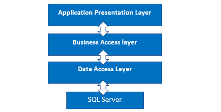

# $~~~~~~~~~~~~~~~~~~~~~~~~~~~~~~~~~~~$ Spring

---
# Technical query :-
 + manivannan.palaniswamy@skill-lync.com
 # Non-Technical query :-
 + support@skill-lync.com
---
# $~~~~~~~~~~~~~~~~~~~~~~~~~~~~~~~~~~$ Agenda
---
# $~~~~~~~~~~~~~~~~~~~~~~~~~~~~$ What is Spring?
The Spring Framework (Spring) is an open-source application framework that provides infrastructure support for developing Java applications. One of the most popular Java Enterprise Edition (Java EE) frameworks, Spring helps developers create high performing applications using plain old Java objects 
---
---
# $~~~~~~~~~~~~~~~~~~~~~~~~~~~~~~$ Why is Spring?
### Java programs are complex and feature many heavyweight components. Heavyweight means the components are dependent on the underlying operating system (OS) for their appearance and properties.

### Spring is considered to be a secure, low-cost and flexible framework. Spring improves coding efficiency and reduces overall application development time because it is lightweight -- efficient at utilizing system resources -- and has a lot of support.

---

# $~~~~~~~~~~~~~~~$ Advantages of Spring Framework
+ Predefined Templates
+ Loose Coupling
+ Easy to test
+ Lightweight
+ Fast Development
+ Powerful abstraction
---
  
---
---
  
---
---
- Docker is a platform that enables developers to easily create, deploy, and run applications in containers.

- Containers are lightweight, portable, and self-contained environments that allow applications to run consistently across different operating systems and infrastructure.

- Docker provides a set of tools and services that make it easy to create and manage containers, including a container runtime, an image registry, and a container platform.
---
- # Containers
- # Docker images
---
# Advantages of using Docker:
- Portability
- Resource efficiency
- Rapid deployment
- Version control
- Security
---
## Disadvantages of using Docker:
- Complexity
- Limited Support